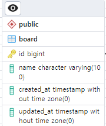
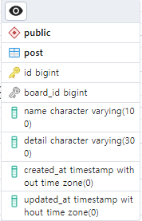
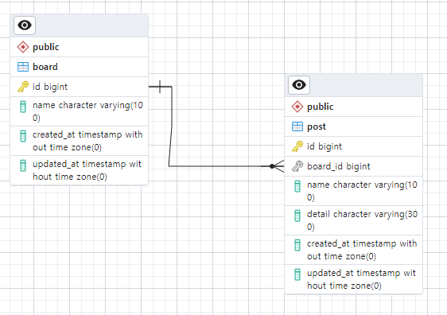

# Laravel 게시판 api 구현

## 구현 환경

-   window 11
-   Laravel : 10+
-   PHP : 8.2.10
-   nginx : 1.24
-   Database : PostgreSQL

### nginx + Laravel 구성 방법

[노션 링크](https://lydian-opera-00c.notion.site/9-19-4395039683cb4d68a64ac87815ae2ca6?pvs=4)

## DB

-   게시판 Table
    ```
    $table->id();
    $table->string('name',100);
    $table->timestamps();
    ```
    
-   포스트 Table

    ```
    $table->id();
    table->unsignedBigInteger('board_id');
    $table->string('name',100);
    $table->string('detail',300);
    $table->timestamps();
    $table->foreign('board_id')->references('id')->on('board')->onDelete('cascade');
    ```

    

-   관계

    일대다 관계
    

## 게시판 RESTful API

| Method | URL                          | 설명             |
| ------ | ---------------------------- | ---------------- |
| POST   | /board                       | 게시판 생성      |
| GET    | /board                       | 전체 게시판 읽기 |
| GET    | /board/:boardId              | 개별 게시판 읽기 |
| PUT    | /board/:boardId              | 게시판 수정      |
| DELETE | /board/:boardId              | 게시판 삭제      |
| POST   | /board/:boardId/post         | 포스트 생성      |
| GET    | /board/:boardId/post         | 전체 포스트 읽기 |
| GET    | /board/:boardId/post/:postId | 개별 포스트 읽기 |
| PUT    | /board/:boardId/post/:postId | 포스트 수정      |
| DELETE | /board/:boardId/:postId      | 포스트 삭제      |

(Chrome 확장 프로그램 Talend API Tester로 테스트 시 http://localhost/api/board/ 형식으로 해야함)

[api 실행 테스트](https://github.com/Lee-Siyoung/laravel/blob/main/CRUD_TEST.md)

## 실행

-   위치 nginx폴더에서 `nginx.exe`
-   위치 php폴더에서 `php-cgi.exe -b 127.0.0.1:9000`
